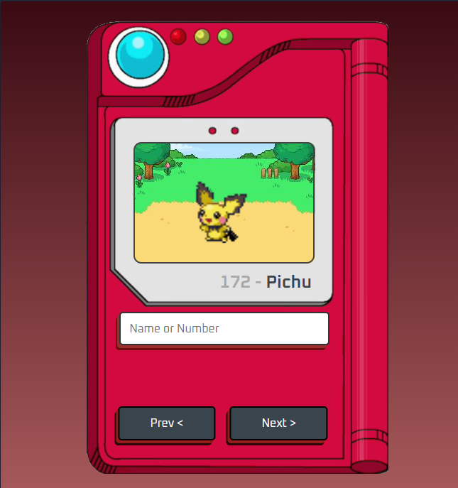
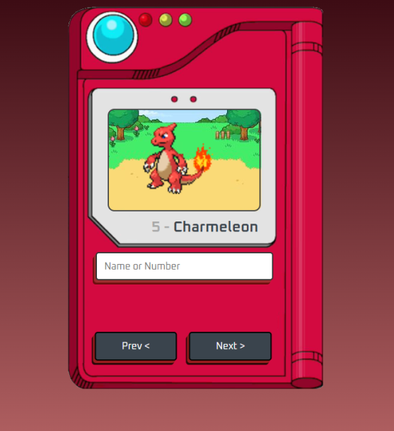

# Simple Pokedex 

A simple Pokedex project using the [PokeAPI](https://pokeapi.co/).

## 💻 About
This project was developed using **HTML, CSS, and JavaScript** to practice fetching data from a REST API and displaying it dynamically on the page.

## 🛠️ Technologies
* HTML5
* CSS3
* JavaScript
* PokeAPI

## 🚀 How to run
1. Download or clone this repository.
2. Open the `index.html` file in your browser.

| | |
|:---:|:---:|
|  |  |
